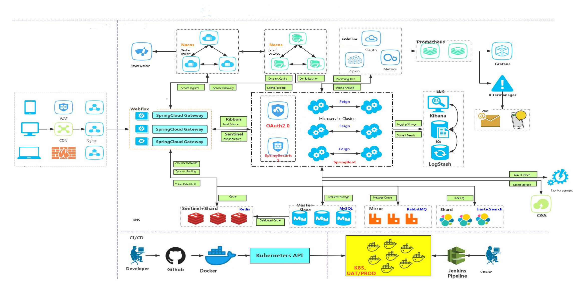
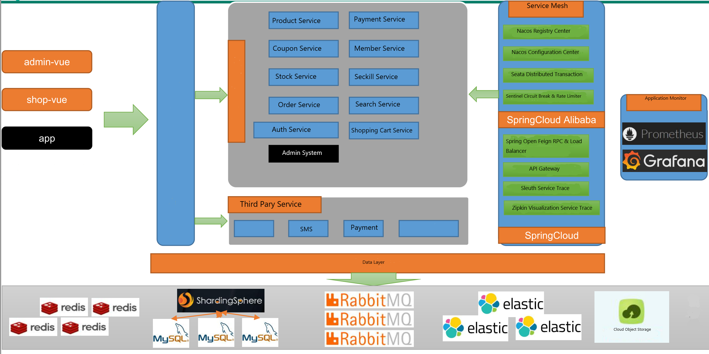

# Gulimall Shopping System

## Project Description

Gulimall is a Ecommerce project, including Shopping System and Content management system. it based on SpringCloud、SpringCloud Alibaba、MyBatis Plus Implementation.
Shopping system includes: User Login, User Register, Product Search, Product description, Shopping Cart, Order and Seckill module.
Content Management system includes: System Management, Product Management, Coupon Management, Stock Management, Order Managment, User Management and Content Management.

## Project Demo

### Shopping System

### Content Management System


## Project Structure

```
gulimall
├── gulimall-common -- Served as general lib
├── renren-generator -- Code auto generator
├── gulimall-auth-server -- Social login OAuth2.0 
├── gulimall-cart -- Shopping cart service
├── gulimall-coupon --  Coupon service
├── gulimall-gateway --  API gateway service
├── gulimall-order --  Order service
├── gulimall-product --  Product service
├── gulimall-search --  Index seach service
├── gulimall-seckill --  Seckill service
├── gulimall-third-party -- Third party service（Object storage, text message）
├── gulimall-ware --  Stock service
└── gulimall-member --  Member service
```

### System Architecture



### Bussiness Design



### Backend Stacks

|        Tech        |           Desc           |                      Offical Site               |
| :----------------: | :----------------------: | :---------------------------------------------: |
|     SpringBoot     |      Container+MVC       |     https://spring.io/projects/spring-boot      |
|    SpringCloud     |      Microservice        |     https://spring.io/projects/spring-cloud     |
| SpringCloudAlibaba |                          | https://spring.io/projects/spring-cloud-alibaba |
|    MyBatis-Plus    |         ORM              |             https://mp.baomidou.com             |
|  renren-generator  | 	      Code Generator    |   https://gitee.com/renrenio/renren-generator   |
|   Elasticsearch    |      Index Engine        |    https://github.com/elastic/elasticsearch     |
|      RabbitMQ      |     Message Queue        |            https://www.rabbitmq.com             |
|   Springsession    |   Distribute Cache       |    https://projects.spring.io/spring-session    |
|      Redisson      |   Distribute Lock        |      https://github.com/redisson/redisson       |
|       Docker       |      Container           |             https://www.docker.com              |
|        OSS         |   Object Storage         |  https://github.com/aliyun/aliyun-oss-java-sdk  |

### Frontend Stacks

|   Tech    |    Desc         |           Site            |
| :-------: | :-------------: | :-----------------------: |
|    Vue    |  F/E framework  |     https://vuejs.org     |
|  Element  |  UI framework   | https://element.eleme.io  |
| thymeleaf | Template engine | https://www.thymeleaf.org |
|  node.js  | server side js  |   https://nodejs.org/en   |

### Development Tools

|     Tools     |        Desc         |                      Site                       |
| :-----------: | :-----------------: | :---------------------------------------------: |
|     IDEA      |         IDE         |     https://www.jetbrains.com/idea/download     |
| RedisDesktop  |   Redis Client      |        https://redisdesktop.com/download        |
|  SwitchHosts  |Local host IP Config |       https://oldj.github.io/SwitchHosts        |
|    X-shell    |      Linux SSH      | http://www.netsarang.com/download/software.html |
|    Navicat    |      DB Client      |       http://www.formysql.com/xiazai.html       |
| PowerDesigner |   DB Design tool    |             http://powerdesigner.de             |
|    Postman    |    API Test tool    |             https://www.postman.com             |
|    Jmeter     |  Performance test   |            https://jmeter.apache.org            |

### Development Environment

|     Tools      | Version |                               Download                                     |
| :-----------: | :----:   | :------------------------------------------------------------------------: |
|      JDK      |  1.8     | https://www.oracle.com/java/technologies/javase/javase-jdk8-downloads.html |
|     Mysql     |  5.7     |                    https://www.mysql.com                                   |
|     Redis     | Redis    |                  https://redis.io/download                                 |
| Elasticsearch | 7.6.2    |               https://www.elastic.co/downloads                             |
|    Kibana     | 7.6.2    |               https://www.elastic.co/cn/kibana                             |
|   RabbitMQ    | 3.8.5    |            http://www.rabbitmq.com/download.html                           |
|     Nginx     | 1.1.6    |              http://nginx.org/en/download.html                             |
